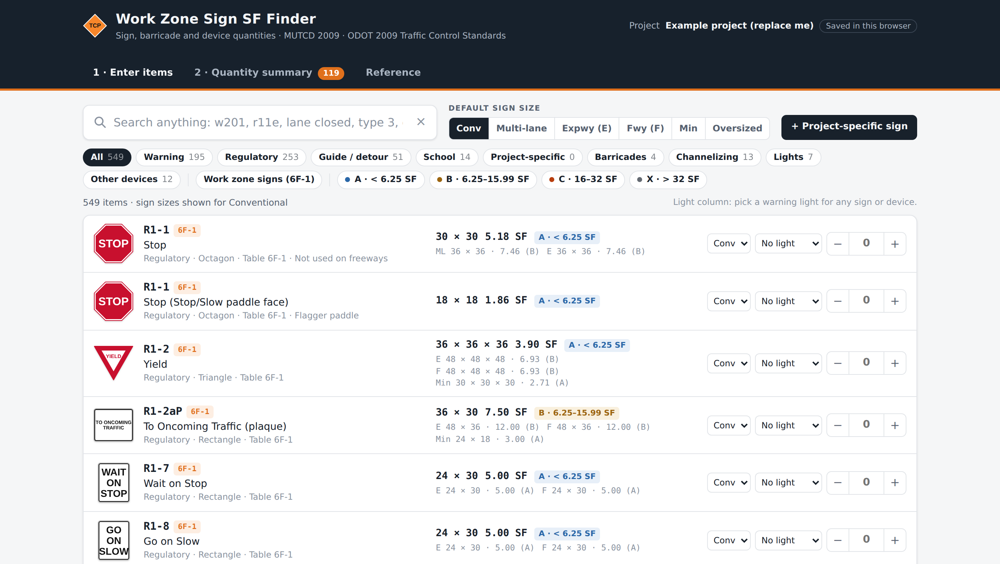
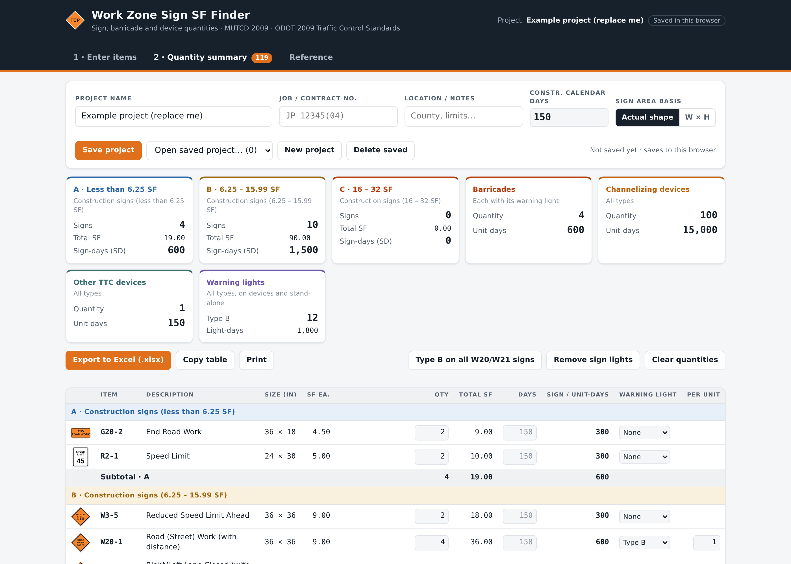
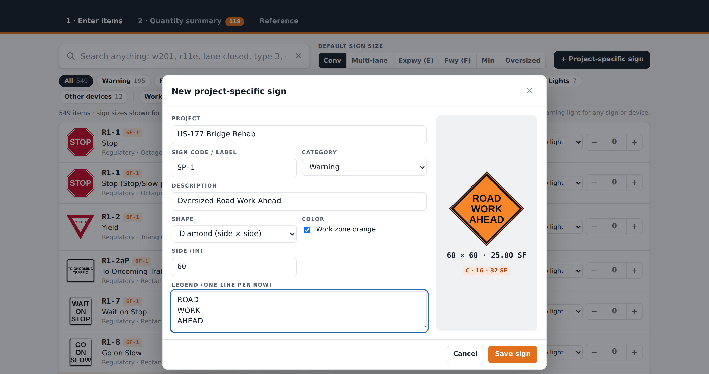

# TCP Quantity Takeoff

**A free, offline-friendly tool for checking traffic control plan quantities: sign square footage, pay ranges, sign-days, barricades, channelizing devices and warning lights.**

Pick a sign by code or by name, get its size and actual square footage, and see which pay range it falls in. Add quantities and construction days, and the tool builds a summary sheet you can export to Excel.

One HTML file. No install, no build step, no server, no account, no tracking.

👉 **[Open the tool](https://UmeshSharma8848.github.io/tcp-quantity-takeoff/)** · [Download for offline use](https://github.com/UmeshSharma8848/tcp-quantity-takeoff/archive/refs/heads/main.zip)



---

## Why this exists

Checking the sign quantities on a traffic control plan usually means flipping between the MUTCD sign size tables, a calculator and a spreadsheet. The sizes are in one document, the square footage math is by hand, and the pay ranges are in the spec. Small shapes make it worse: a 30×30 STOP sign is 5.18 SF as an octagon but 6.25 SF measured as width × height, which lands it in a different pay range.

This tool puts the sizes, the area math, the pay ranges and the quantity totals in one page.

## Who it's for

- **Traffic engineers and EITs** checking pay quantities on traffic control and advance warning plans
- **Plan reviewers** verifying a contractor's or consultant's quantity sheet
- **Estimators and contractors** pricing work zone signing, barricades and channelizing devices
- **Designers** putting together a summary of quantities sheet
- **Inspectors** confirming what's actually installed against what's paid
- **Students** learning MUTCD sign sizes and work zone traffic control

## What it does

**Look up any sign**

- 513 signs from the MUTCD: work zone (Part 6), regulatory, warning, school, bicycle, railroad and some guide and route markers
- Search is forgiving: `w201`, `W20-1`, `w20 1` and `road work` all find the same sign. `r11e` gives you the Expressway size of R1-1
- Size options: Conventional, Multi-lane, Expressway (E), Freeway (F), Minimum and Oversized, wherever the MUTCD tables list them
- Every sign shows its actual square footage and its pay range, plus the same figures for the other sizes
- Simplified drawings of each sign face, so you can confirm you picked the right one

**Get the quantities right**

- Pay ranges: **A** under 6.25 SF · **B** 6.25–15.99 SF · **C** 16–32 SF, with anything over 32 SF flagged separately
- Area basis switch: true shape area, or width × height, to match how your specification measures signs
- Enter the number of each sign, set construction calendar days, and get **sign-days** per pay range

**Barricades, devices and lights**

- Type I, II and III barricades and direction indicator barricades, each carrying a warning light by default
- Channelizing devices: 18" and 28" cones, tall cones, 42" channelizers (Trimline / grabber type), drums, tubular markers, vertical panels, opposing traffic lane dividers and linear-foot devices
- Other devices: arrow boards (Types A–D), portable changeable message signs, flag trees, portable signals, flagger assistance devices, truck-mounted attenuators, crash cushions and portable barrier
- All five MUTCD warning lights: Type A, Type B, Type C, Type D and sequential flashing. Attach them to any sign or device, or count them on their own. The summary totals lights and light-days by type

**Project-specific signs**

Not every sign on a plan is a standard size. Add your own: code, description, shape, dimensions and legend. The tool shows a live preview with the square footage and pay range, saves it under your project name, and includes it in search and in the summary.

**Output**

- Grouped summary sheet with subtotals by pay range and by device category
- Export to Excel (.xlsx) with a summary sheet, a line-by-line quantity sheet and your project-specific signs
- Copy the whole table to the clipboard, or print the summary
- Save and reopen projects



## Quick start

**Use it online** — open the [GitHub Pages link](https://UmeshSharma8848.github.io/tcp-quantity-takeoff/). Nothing to install.

**Use it offline** — download `index.html` and double-click it. It works with no internet connection; only the web fonts and the Excel export library load from a CDN, and the tool still runs without them (the Excel button needs the library, but Copy table always works).

**Put it on your own site** — copy `index.html` anywhere that serves static files.

## How to use it

1. **Enter items.** Search for a sign or device, set the size you need, pick a warning light if it has one, and enter the quantity with the **+ / −** buttons.
2. **Quantity summary.** Fill in the project name and the construction calendar days. Check the sign-days, total SF and light totals. Adjust quantities, days or lights on any line.
3. **Export.** Send it to Excel, copy the table into your own spreadsheet, or print it.

The tool opens with an example project loaded so you can see how it works. Use **Clear quantities** and **New project** to start your own.



## How the area is calculated

| Shape | Formula | Example |
|---|---|---|
| Rectangle | W × H | 36 × 18 = 4.50 SF |
| Diamond (sizes are side × side) | W × H | 36 × 36 = 9.00 SF |
| Octagon | 0.8284 × W² | 30 × 30 = 5.18 SF |
| Equilateral triangle | 0.4330 × S² | 36 = 3.90 SF |
| Circle | π × D² / 4 | 36 dia. = 7.07 SF |
| Pennant | ½ × base × height | 48×48×36 = 5.56 SF |
| Pentagon (school) | ≈ 0.75 × W × H | 36 × 36 = 6.75 SF |
| Crossbuck | 2LW − W² | 48 × 9 = 5.44 SF |

Rounded corners are ignored. Switching the area basis to **W × H** uses width × height for every shape instead, which is how some agencies measure sign area for payment. Check the measurement section of your specification before you rely on either one.

## Sign code conventions

| Code | What it means |
|---|---|
| `W20-5a` | A lowercase letter is a different **version** of the sign, not a different size |
| `W13-1P` | `P` is a **plaque**, mounted below a primary sign |
| `R1-1E` / `R1-1F` | Plan sign lists use `E` and `F` for the **Expressway** and **Freeway** sizes. The MUTCD itself doesn't use these suffixes |

## Data sources

- MUTCD 2009 **Table 6F-1** — temporary traffic control zone sign and plaque sizes
- MUTCD 2009 **Table 2B-1** (regulatory), **Table 2C-2** (warning), **Table 7B-1** (school), **Table 9B-1** (bicycle), and a few route markers from Table 2D-2
- MUTCD 2009 **§6F.60–6F.87** — channelizing devices, barricades, arrow boards and warning lights
- [ODOT 2009 Traffic Control Standards](https://www.odot.org/traffic/traffic2009/trf_std_2009-control.php) (T-501 through T-525), which follow Table 6F-1
- Sign-day practice follows ODOT plan notes, where sign quantities are computed as signs × construction calendar days

## Accuracy and limits

**This is a checking aid, not an authority. The project plans, the agency standards and the special provisions govern.**

- Sizes were transcribed from the published MUTCD tables. A few entries are marked "verify" because they were filled in from a secondary source
- The ODOT standard sheets are scanned images, so the sizes were not checked against them sheet by sheet
- Sign faces are simplified drawings, not the official sign designs. Many symbol signs are drawn as text
- Pay ranges and unit names follow common practice. Confirm the pay item names, units and measurement method against your own specification
- The default of one Type B light on each barricade and advance warning sign is a convenient starting point, not a code requirement

Found something wrong? [Open an issue](https://github.com/UmeshSharma8848/tcp-quantity-takeoff/issues) with the sign code and the correct size, and please cite the table you're reading from.

## Privacy and data

Everything runs in your browser. Projects and project-specific signs are stored in that browser's local storage. Nothing is uploaded, and there's no analytics, no account and no server. Clearing your browser data clears your saved projects, so export anything you need to keep.

## Browser support

Any current version of Chrome, Edge, Firefox or Safari, on desktop or phone. It follows your system's light or dark theme.

## Repository layout

```
index.html                 The complete tool — this single file is the whole app
docs/                      Screenshots used in this README
src/                       Source files the single page is assembled from
  signs3.js                Sign data (code, name, shape, sizes per road type, source table)
  devices.js               Barricades, channelizing devices, lights, other devices
  faces3.js                Sign face drawing (SVG)
  app.js, app.css          Application logic and styles
  body.html                Page markup
  assemble.py              Concatenates src/ into index.html
  build.py                 Rebuilds signs3.js from the MUTCD table CSVs
```

To rebuild after editing anything in `src/`:

```bash
cd src && python3 assemble.py
```

## Contributing

Corrections to sign sizes are the most useful contribution, especially with a citation. Adding a state DOT's device names and pay items would also help. See [CONTRIBUTING.md](CONTRIBUTING.md).

## Roadmap

- Verify every size against the ODOT standard sheets
- 2023 MUTCD (11th edition) sizes alongside the 2009 sizes
- Sign faces closer to the official designs
- Per-state pay item names and units
- Import an existing quantity list from CSV

## License

[MIT](LICENSE) — free to use, change and share, including commercially. Attribution appreciated.

MUTCD sign designs and the tables the data comes from are publications of the U.S. Federal Highway Administration and are in the public domain.

## Author

Built by **Umesh Sharma**, a traffic engineer, from the day-to-day job of checking pay quantities on traffic control plans. If it saves you an afternoon, a ⭐ on the repo helps other people find it.

---

*Keywords: MUTCD, traffic control plan, TCP, work zone, temporary traffic control, sign square footage, pay quantities, sign-days, quantity takeoff, barricades, channelizing devices, warning lights, ODOT, traffic engineering*
